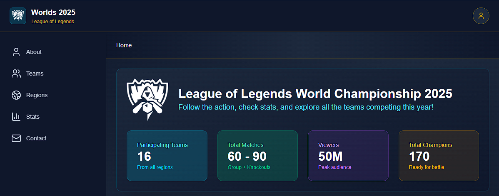

# Worlds 2025 Dashboard – League of Legends


**Interactive dashboard with statistics from the Worlds 2025 League of Legends.**

---

## 🔍 Preview

  

---

## 🕹 About the Project

Simulates a **data analysis dashboard** for the LoL 2025 World Championship.  

### 💠 Main Layout
-  **Topbar:** main navigation and branding  
-  **Sidebar:** side menu navigation  
-  **Breadcrumb:** current location indicator  
-  **Content Area:** data visualization and charts  

### 💠 Sections
-   **Stats:** bar and line charts  
-   **Regions:** cards with region info and team count  
-   **Teams:** list of teams with logos (mock data)  
-   **Contact:** functional contact form (simulated)  

---

## 💠 Features

-  **Responsive dashboard** for desktop and mobile  
-  **Interactive charts** with Chart.js  
-  **Reusable components** with React + TypeScript  
-  Clear navigation with Topbar, Sidebar, and Breadcrumb  
-  **Optimized UX:** consistent height and alignment in cards and forms  

---

## 🛠 Technologies

| Technology        | Badge / Color                                                                 |
|------------------|-------------------------------------------------------------------------------|
| **Next.js 15**    |  |
| **React 19**      |  |
| **TypeScript 5**  |  |
| **Tailwind CSS 4**|  |
| **Chart.js 4**    |  |
| **Lucide React**  |  |
| **Creative Tim Gradient Generator** | 🎨 Quick and aesthetic color combinations |

---

## 💠 AI Assistance

During development, **ChatGPT** was used to:

-  **Debug warnings:** `width/height` issues in images and proper use of Next.js `Image` component  
-  **Breadcrumb & Layout:** optimize structure and visual hierarchy  
-  **Tailwind CSS:** alignment, spacing, and responsive flow  
-  **Chart.js:** suggestions for chart setup and visualization options  

---

## 🔰 Project Colors

- 🔳 **Slate 900:** Main dark background  
- 🟦 **Cyan:** Bright accent colors  
- 🟩 **Emerald:** Green for buttons or positive indicators  
- 🟪 **Purple:** Vibrant purple to highlight elements  
- 🟨 **Amber:** Warm yellow for alerts or buttons  
- ⬜ **White:** White for text and contrast  

---

## 🔁 Installation & Run

Clone the repository and run the project locally:

```bash
# 1️⃣ Clone the repository
git clone https://github.com/SantiHSS/Worlds-2025-Dashboard.git

# 2️⃣ Go into the project folder
cd dashboard-lol

# 3️⃣ Install dependencies
npm install

# 4️⃣ Start the development server
npm run dev
